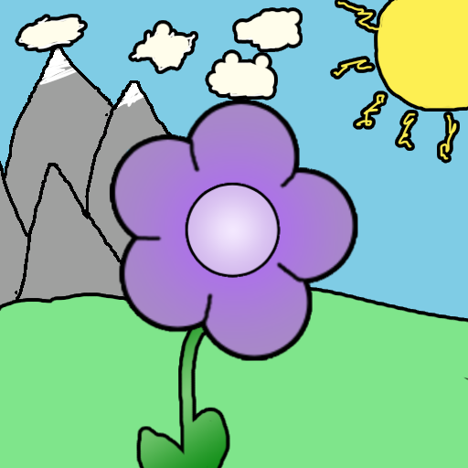

  
<h1 align="center">Violet</h1>

> ### __An addon for the [Project: Lotus](https://lotusau.top/) Among Us Mod.__ 
> This addon/mod is not affiliated with Among Us or Innersloth LLC, and the content contained therein is not endorsed or otherwise sponsored by Innersloth LLC. 
 Portions of the materials contained herein are the property of Innersloth LLC.  

### [Download Violet](https://github.com/ThetaHalo/Violet/releases/latest) - [Download Project: Lotus](https://get.lotusau.top/)  
--- 

### 🪷 - This requires Project: Lotus in order to work. You can install it from the link above.

## Additions:
- An in-game GUI for searching roles.
- Included Crowded Support, meaning you can play with 15+ players on Modded Regions.
- Includes a Custom Discord Presence which shows information about your lobby (Players, Map, etc)
- Adds support for **ehT dlekS**, so you can play it in Project: Lotus.
- "Functional" support for The Fungle (You can play the CTF & ETF Gamemodes, as well as use Random Spawn)
- "Functional" support for Submerged (Random Spawn support & CTF Support)
- 10 new modifiers, 8 new roles, and more on the way!
- Show the result of the previous meeting above the Meeting Table.
- Shows notification messages in meeting displaying the time left.
- Command Suggestions: Autocomplete commands by pressing tab while typing one.
- Various UI Improvements.
- Support for changing the scale of the GUI.
- Support for zooming the camera out when dead or when in lobby.
- A simple in-game anticheat for blocking malicious hackers in lobby.
- Private chats for Impostors, Romantics & Jailor/Jailed People. Strategize with your impostor teammates or plead for your life.
- Option to automatically recreate your lobby upon disconnecting, mainly for auto-hosters.
- Various new commands for moderation, fun, and miscellaenous things.
- Various custom buttons for roles (which replace the vanilla buttons).

---

## Commands
> All commands are prefixed with `/cmd`, (ex: `/cmd endmeeting`)
- /endmeeting     [Host-Only | Ends the currently active meeting. ]
- /fixme          [In-Game Only | Attempts to fix your blackscreen (if you get access to a chat.) ]
- /impostorchat   [In-Game Only | Send a message to your impostor partners. ]
- /jailorchat     [In-Game Only | If Jailor or Jailed, talk to the Jailed/Jailor. ]
- /romanticschat  [In-Game Only | Talk to your romantic partner as a Romantic (or romanced player) ]
- /kill           [Moderator Only | Kill/Execute a player ]
- /rtp            [In-Game Only | Teleport to a random room on the map (when dead.) ]
- /rr             [Play a game of Russian Roulette, if you lose then you will be kicked. (Host can disable this by doing /cmd rr toggle)]
- /vote           [In-Game Only | Vote a player in the current meeting (meant for when using Crowded.) ]

---

## Roles:
### Impostors: (2)

**Animator** - <u>Control other players</u> 
The Animator is an Impostor role which can control & impersonate other players in the game.

They first need to mark a player in order for that player to become an option, then you can use your Shapeshifter Menu in order to select them. Once selected, you will teleport to their current location and control them; while controlling another player, you will remain standing at your old position, and will teleport back when the animation duration is over.

Optionally, you can switch between killing normally and marking with the Pet Button. Also optionally, you can choose to kill the player once your timer runs out to control them.

|    <u>Options</u>   |
| :-----------------: |
|  Can Kill Normally  |
|  Kill After Timer   |
|  Animation Duration |
|  Animation Cooldown |

🪷🪷🪷

**Brewologist** - <u>Brew potions to get random effects!</u> 
The Brewologist is an Impostor which can brew potions to give random harmful/annoying effects to players.

---
### Crewmates: (2)

**Enderman** - <u>Teleport Anywhere!</u> 
The Enderman is a Crewmate which has the ability to teleport to a random spot on the map using the pet button.

|    <u>Options</u>   |
| :-----------------: |
| Number of Teleports |
|  Teleport Cooldown  |

💫💫💫

**Time Lord** - <u>Rewind Time!</u> 
 As the Time Lord, you can use your pet button to rewind time by a few seconds.

By rewinding time, you will revive any players who died between now and then, as well as teleporting everyone back to where they were previously.

|    <u>Options</u>   |
| :-----------------: |
|  Rewind Seconds     |
|  Rewind Cooldown    |
|  Max Rewinds        |

---
### Neutrals: (4)

**Bandit** - <u>Steal a player's role!</u> 
The Bandit is a Neutral which has the ability to steal someone's role's when that person dies.

Vote the person you wish to have the roles of in meeting, and once that person dies you will get their roles!

|      <u>Options</u>    |
| :--------------------: |
|  Steal Target Subroles |

⭐⭐⭐

<b>[Suggested By: NickMasterXX]</b> 
**Craftsman** - <u>Craft items to help yourself win!</u> 
The Craftsman is a Neutral Killing role which gets random items to help them in winning.

To craft a random item, the Craftsman must first collect points, you can do this by killing other players.

Once you have enough points, you can use the Pet Button to craft a random item.

You can then use this item by clicking the Pet Button again.

**Items:**

- Adrenaline: Gives you a speed boost & makes your kill cooldown shorter for a short time.

- Bullet: This will reset your kill cooldown.

- Bomb: A bomb that can be planted to kill players.

- Costume: A costume that can be used to disguise yourself as another player.

- Sword: An item that will teleport you to a player and kill them.

- Cloak: A cloak that can be used to become invisible for a short time.

- Rigged Gun: A gun which will kill you. (:skull:)

|      <u>Options</u>      |
|  :---------------------: |
|        Can Vent          |
|     Starting Points      |
|       Points Per Kill    |
|     Modify Item Costs    |
|      Modify Item Timers  |

⭐⭐⭐

**Shifter** - <u>Shift Roles with other players</u> 
As the Shifter, you have the unique ability to steal the roles of other members of the crew! When you use your kill button on someone, it'll steal their role.. and depending on settings, their modifiers too! 

But be careful, because depending on settings, you may suicide if you try to shift the roles of the wrong person.

This role is based on Shifter from Old TOU

|        <u>Options</u>        |
| :--------------------------: |
| Role Shift Cooldown          |
| Pass Shifter on Shift        |
| Steal Subroles               |
| Suicide on certain Factions: |
| - Suicide on Crew -          |
| - Suicide on Impostors -     |
| - Suicide on Neutrals -      |

⭐⭐⭐

**Static** - <u>Stun Players!</u> 
The Static is a neutral killing role which stuns your opponents for a short time. While stunned, they will move at a slower speed, and if they are stunned too many times, they will die.

|      <u>Options</u>    |
| :--------------------: |
|      Stun Radius       |
|      Stun Duration     |
|      Stun Cooldown     |
---

### Modifiers: (10)

**Bad Hip** - <u>You get slower as the game goes on.</u> 
As the Bad Hip Modifier, your movement speed decreases as the game progresses.

|      <u>Options</u>    |
| :--------------------: |
| Speed Debuff Per Round |

🔪🔪🔪

**Car** - <u>Fling Everyone around!</u> 
The Car is a "vehicle" that can be driven around the map. It can be used to run over players, which will fling them around the map!

This role is based on the Car role from EHR

|    <u>Options</u>    |
| :-----------------:  |
|    Fling Distance    |
|    Speed Decrease    |
| Teleport out of Wall |

🔪🔪🔪

<b>[Coded By: Discussions]</b> 
**Drunken** - <u>Inverted Controls</u> 
The Drunken modifier inverts your movement controls, making it more difficult to navigate the map. Trying to go down, makes your character go up, and vice versa. The same applies for left and right.

🔪🔪🔪

**Eavesdropper** - <u>Eavesdrop on private chats</u> 
The Eavesdropper is a modifier which is able to listen to all private chats in the game, like Impostor, Romantic, and Jailor chats. However, you cannot see the player which has sent this message.

🔪🔪🔪

**Fragile** - <u>You are a fragile person, you break easily</u> 
The Enderman is a Crewmate which has the ability to teleport to a random spot on the map using the pet button.

|    <u>Options</u>             |
| :-----------------:           |
| Break On Crew Interaction     |
| Break On Impostor Interaction |
| Break On Neutral Interaction  |
| Interactor Shows As Killer    |

🔪🔪🔪

<b>[Suggested By: .s.i.l.v.e.r.]</b> 
**Informant** - <u>Know your impostor allies</u> 
You know who your fellow Impostors and Madmates are (marked with a <b>♼</b>), and perhaps some others loyal to the cause.

|            <u>Options</u>            |
| :----------------------------------: |
| Impostor can be Informant            |
| Madmates can be Informant            |
| Restrict allies Informant can see    |
| Informant can see Impostors          |
| Informant can see Madmates           |
| Informant can see Mad Snitches       |
| Informant can see Mad Guardians      |
| Informant can see Crewpostors        |
| Informant can see Parasites          |
| Informant can see Rebellious         |

🔪🔪🔪

<b>[Suggested By: Moosa0200]</b> 
**Perseverer** - <u>Persevere through an unlucky meeting.</u> 
The Perseverer is a modifer which can win with anyone (like Survivor/Opportunist), but unlike those two, they must first be voted out to unlock this ability.

|    <u>Options</u>   |
| :-----------------: |
| Votes Needed to Win |
| Only Win If Exiled  |
| Win If Dead         |

🔪🔪🔪

<b>[Suggested By: CashelP14]</b> 
**Re-Roll** - <u>Don't like your role? Re-roll it!</u> 
The "Re-Roll" is a modifier which allows you to re-roll your primary role, if you don't like it! To re-roll the role, just vote yourself in meeting.

|    <u>Options</u>                |
| :-----------------:              |
| Restrict Re-Roll to Same Faction |
| Reroll Amount                    |
| Restrict to Compatible Roles     |

🔪🔪🔪

**Sugar Rush** - <u>wooooo~</u> 
The Sugar Rush is a modifier which makes you speed throughout the map.

---

## Credits:
**Individuals**
> [ThetaHalo](https://github.com/ThetaHalo) - Developer of Violet.  
> [Discussions](https://github.com/discus-sions) - Lead Dev of Project: Lotus, also provided code for Drunk Modifier & various pieces of code around the addon.  
> Piggy B - Various art assets (which were included in Lotus but were reused in Violet) 
> **Violet's Testers: Silver, Timmay, AnonWorks, Mama BB & Others**

**Mods**
> [Lotus-AU/LotusContinued](https://github.com/Lotus-AU/LotusContinued): Various code snippets & code references, also the only reason this addon exists.  
> [ThetaHalo/LotusDiscordRPC](https://github.com/thetahalo/lotusdiscordrpc): Code for the Discord Presence. 
> [CitrionDragon/CrowdedAddon](https://github.com/citriondragon/crowdedaddon): Code for the Crowded Patch (though modified). 
> [Gurge44/EndlessHostRoles](https://github.com/Gurge44/EndlessHostRoles): Idea for Car Role 
> [Tommy-XL/Unlock-dlekS-ehT](https://github.com/Tommy-XL/Unlock-dlekS-ehT) - Code for DleksPatch 
> [AU-Avengers/TOU-Mira](https://github.com/AU-Avengers/TOU-Mira) & All-Of-Us-Mods/MiraAPI: Code reference for features like GUI Scale & Role Tab 
> [D1GQ/BetterAmongUs](https://github.com/D1GQ/BetterAmongUs): Code reference for Command Suggestions & Certain Meeting UI Changes.  
> [TownOfNext/TownOfNext](https://github.com/TownOfNext/TownOfNext): Code for ZoomPatch.  
> Reactor: Code for skipping intro cutscene when opening game.
